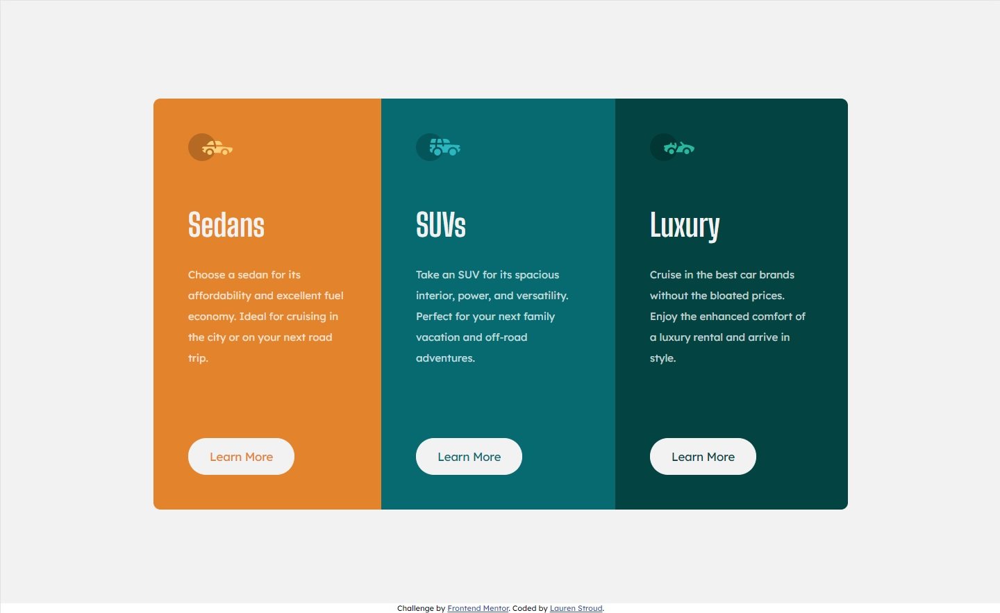

# Frontend Mentor - 3-column preview card component solution

This is a solution to the [3-column preview card component challenge on Frontend Mentor](https://www.frontendmentor.io/challenges/3column-preview-card-component-pH92eAR2-). Frontend Mentor challenges help you improve your coding skills by building realistic projects. 

## Table of contents

- [Overview](#overview)
  - [The challenge](#the-challenge)
  - [Screenshot](#screenshot)
  - [Links](#links)
- [My process](#my-process)
  - [Built with](#built-with)
  - [What I learned](#what-i-learned)
  - [Continued development](#continued-development)
  - [Useful resources](#useful-resources)
- [Author](#author)
- [Acknowledgments](#acknowledgments)

## Overview

### The challenge

Users should be able to:

- View the optimal layout depending on their device's screen size
- See hover states for interactive elements

### Screenshot

### Links

- Solution URL: [https://github.com/CommanderMeow/3-column-preview-card-component-main](https://github.com/CommanderMeow/3-column-preview-card-component-main)
- Live Site URL: [https://commandermeow.github.io/3-column-preview-card-component-main/](https://commandermeow.github.io/3-column-preview-card-component-main/)

## My process

### Built with

- Semantic HTML5 markup
- Sass css
- Flexbox

### What I learned

I decided to try a simple card so I could try and understand Sass and how to set up a SCSS file. 
### Continued development

I intend to continue using Sass as I found the work process was a lot easier and far more intuitive compared to regular CSS. 

## Author

- Frontend Mentor - [@CommanderMeow](https://www.frontendmentor.io/profile/CommanderMeow)

